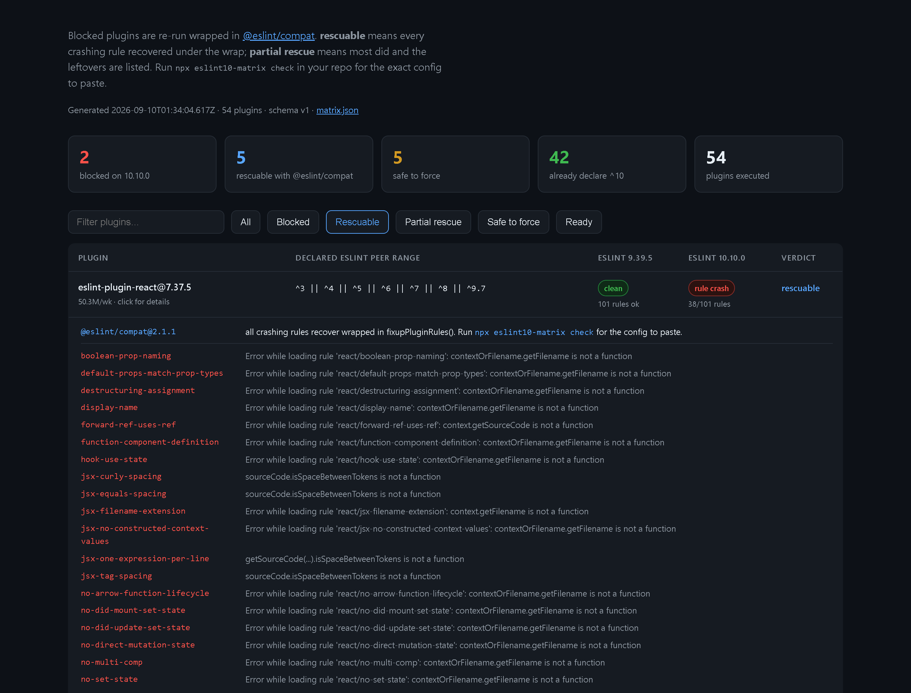

# eslint10-matrix

**Can this repo upgrade to ESLint 10 yet?** Answered by running the plugins, not by reading their manifests.

Three facts, all verifiable at the npm registry right now:

| package | latest version | declared `peerDependencies.eslint` |
| --- | --- | --- |
| `eslint-plugin-react` | 7.37.5 (2025-04-03) | `^3 \|\| ^4 \|\| ^5 \|\| ^6 \|\| ^7 \|\| ^8 \|\| ^9.7` |
| `eslint-plugin-jsx-a11y` | 6.10.2 (2024-10-26) | `^3 \|\| ^4 \|\| ^5 \|\| ^6 \|\| ^7 \|\| ^8 \|\| ^9` |
| `eslint-plugin-import` | 2.32.0 | `^2 \|\| ^3 \|\| ^4 \|\| ^5 \|\| ^6 \|\| ^7.2.0 \|\| ^8 \|\| ^9` |

ESLint's own latest is **10.10.0**. Every one of those ranges excludes it, so `npm install` refuses to resolve them against ESLint 10 and every readiness dashboard built on manifest data marks all three as blocked.

That answer is wrong in both directions. Executed against real ESLint 10.10.0 with every rule enabled:

- `eslint-plugin-import@2.32.0` declares `^9` and **mostly runs**. Three of its 46 rules crash (`no-default-export`, `no-named-export`, `unambiguous`); the other 43 are fine, and all three recover under `@eslint/compat`.
- `eslint-plugin-jsx-a11y@6.10.2` declares `^9` and is **completely clean**, all 39 rules, no crashes. Nothing is wrong with it. The range is just stale.
- `eslint-plugin-react@7.37.5` declares `^9` and **38 of its 101 rules throw**, including `display-name` with `contextOrFilename.getFilename is not a function`, exactly [issue #3977](https://github.com/jsx-eslint/eslint-plugin-react/issues/3977), open since February 2026 with hundreds of reactions.

And the failure does not have to be yours. `eslint-plugin-vitest@0.5.4` and `eslint-plugin-deprecation@3.0.0` both **fail to import entirely** on ESLint 10, because `@typescript-eslint/utils` does `class extends eslint.LegacyESLint` and ESLint 10 removed `LegacyESLint` along with eslintrc. Neither plugin's own manifest hints at that.

A declared range is a claim its author last checked at publish time. The only ground truth is execution.

**Live matrix: <https://booyaka101.github.io/eslint10-matrix/>**

## Install

```
npx eslint10-matrix scan
```

No install needed. Node 22 or newer, no runtime dependencies.

## Two questions, two commands

`check` reads the published board: for each plugin your config uses, what happened when **the latest
published version** of it was executed against a fixture corpus. That answers *what is the state of
the ecosystem*, it needs no install and it returns in under a second.

`scan` executes here, in your checkout, at **the versions in your `node_modules`**, over **your own
source files**. That answers *can I upgrade this repo*. It takes a few minutes and it can disagree
with the board in both directions: a plugin the board calls clean can crash on a syntax your code
uses and nothing in the corpus does, and a plugin the board calls blocked may be fine at the older
version you have pinned.

Run `check` to see where the ecosystem is. Run `scan` before you actually do the upgrade.

## `scan`: your versions, your files

```
$ cd examples/react-app && npx eslint10-matrix scan

ESLint 10.10.0 readiness for D:\Repos\ideas\eslint10-runtime-matrix\examples\react-app (5 plugins)
executed here against your installed versions on 7 files, baseline eslint 9.39.5

BLOCKED (1)
  eslint-plugin-vitest@0.5.4  fails to load on 10.10.0
                              @eslint/compat did not help: still fails to load with @eslint/compat installed: Class extends v…

RESCUABLE (2)  crashes as published, verified clean when wrapped with @eslint/compat
  npm install --save-dev @eslint/compat, then in eslint.config.js:

  eslint-plugin-import@2.32.0  4 rules crash on 10.10.0, all recover wrapped in fixupPluginRules()
    import/order crashed on src\components\Catalogue.jsx: sourceCode.getTokenOrCommentBefore is not a function

    import { fixupPluginRules } from '@eslint/compat';
    import pluginImport from 'eslint-plugin-import';

    export default [
      // ...the rest of your config
      {
        plugins: { import: fixupPluginRules(pluginImport) },
      },
    ];

  eslint-plugin-react@7.37.5  6 rules crash on 10.10.0, all recover wrapped in fixupPluginRules()
    react/forward-ref-uses-ref crashed on eslint.config.js: Error while loading rule 'react/forward-ref-uses… (6 more files)

    import { fixupPluginRules } from '@eslint/compat';
    import react from 'eslint-plugin-react';

    export default [
      // ...the rest of your config
      {
        plugins: { react: fixupPluginRules(react) },
      },
    ];

SAFE TO FORCE (1)  declared below ^10, verified clean on 10.10.0 with all rules enabled
  eslint-plugin-jsx-a11y@6.10.2

  Add to package.json to install them against ESLint 10 anyway:
    {
      "overrides": {
        "eslint-plugin-jsx-a11y": {
          "eslint": "$eslint"
        }
      }
    }

CLEAN (1)  already declares ^10
  eslint-plugin-promise@7.3.0

3 of 5 plugins block the upgrade to ESLint 10.10.0 (2 of them rescuable with @eslint/compat).
```

That is a real run against [`examples/react-app`](examples/react-app), a small React app with five
plugins in its flat config. Two rows differ from the board, and both differences are the reason the
command exists.

`eslint-plugin-import` crashes in **four** rules here, not the three the board reports. The extra one
is `import/order`, which dies on `sourceCode.getTokenOrCommentBefore is not a function` in
`src\components\Catalogue.jsx`. It runs clean over the fixture corpus. That is a crash you would only
have found by linting your own code, which is the gap the board cannot close.

`eslint-plugin-react` crashes in **six** rules here, not the board's 38, because the board runs it at
`settings: { react: { version: 'detect' } }` and this app pins `18.3`. Version detection is what
reaches most of the removed `context` APIs, so pinning it avoids 32 of the crashes. Your settings
are part of your answer, and `scan` reads them out of your config.

`scan` runs each plugin in a temp directory against real ESLint 9 and real ESLint 10 with the
versions your lockfile pins, so the numbers are about your repo and nothing else. The installs are
cached under `~/.cache/eslint10-matrix/envs` and pruned after 14 days, so the second run is much
faster than the first.

What it refuses to do:

- **No `node_modules`**: it stops with exit 2 and tells you to install. It will never quietly fall back to whatever npm publishes as latest, because that is the question `check` answers.
- **A repo still on `.eslintrc`**: it stops and says ESLint 10 removed eslintrc, so no plugin version can make that repo run on 10. That is a real answer, just not one this tool can measure.
- **A plugin installed but not referenced by the config**: skipped, and named in a note at the end.
- **A monorepo root**: the config nearest the path you gave is the one measured. Workspace globs are detected and reported, but the packages under them are not walked. Point `scan` at each package.
- **A crash that does not reproduce**: every regression is measured twice, and only rules that crash on both runs are reported.
- **A config it cannot import**, such as one that default-exports a function or a TypeScript config this Node cannot strip: it stops and names the reason. `--plugins eslint-plugin-a,eslint-plugin-b` gets you a measurement anyway, using your installed versions and your files but none of the config's `ignores` or `settings`.

## `check`: the published board

```
$ cd examples/react-app && npx eslint10-matrix check --matrix ../../matrix.json

ESLint 10.10.0 readiness for D:\Repos\ideas\eslint10-runtime-matrix\examples\react-app (5 plugins)
matrix generated 2026-09-10T01:34:04.617Z

BLOCKED (1)
  eslint-plugin-vitest@0.5.4  fails to load on 10.10.0
                              @eslint/compat did not help: still fails to load with @eslint/compat installed: Class extends v…

RESCUABLE (2)  crashes as published, verified clean when wrapped with @eslint/compat
  npm install --save-dev @eslint/compat, then in eslint.config.js:

  eslint-plugin-import@2.32.0  3 rules crash on 10.10.0, all recover wrapped in fixupPluginRules()

    import { fixupPluginRules } from '@eslint/compat';
    import pluginImport from 'eslint-plugin-import';

    export default [
      // ...the rest of your config
      {
        plugins: { import: fixupPluginRules(pluginImport) },
      },
    ];

  eslint-plugin-react@7.37.5  38 rules crash on 10.10.0, all recover wrapped in fixupPluginRules()

    import { fixupPluginRules } from '@eslint/compat';
    import react from 'eslint-plugin-react';

    export default [
      // ...the rest of your config
      {
        plugins: { react: fixupPluginRules(react) },
      },
    ];

SAFE TO FORCE (1)  declared below ^10, verified clean on 10.10.0 with all rules enabled
  eslint-plugin-jsx-a11y@6.10.2

  Add to package.json to install them against ESLint 10 anyway:
    {
      "overrides": {
        "eslint-plugin-jsx-a11y": {
          "eslint": "$eslint"
        }
      }
    }

CLEAN (1)  already declares ^10
  eslint-plugin-promise@7.3.0

3 of 5 plugins block the upgrade to ESLint 10.10.0 (2 of them rescuable with @eslint/compat).
```

Same repo, same five plugins, same verdict vocabulary. The differences are the ones described above:
`check` reports each plugin's latest published version measured over a fixture corpus, `scan`
reports the version installed here measured over this app's own files. `--matrix` is pointing at the
board committed to this repo; without it the command fetches the published one, which is the same
board a deploy behind.

The buckets are the whole point:

- **BLOCKED**. Actually breaks, and wrapping does not help. Wait for a release, switch plugin, or disable the crashing rules.
- **RESCUABLE**. Breaks as published, but every crashing rule recovers when the plugin is wrapped with [@eslint/compat](https://www.npmjs.com/package/@eslint/compat). The report prints the exact `eslint.config.js` wiring to paste.
- **PARTIAL-RESCUE**. The wrap fixes most crashing rules; the report names the ones you still have to disable.
- **SAFE TO FORCE**. Declares an old range but runs clean with every rule enabled. The `overrides` block installs it against ESLint 10 anyway. `$eslint` resolves to whatever your root `eslint` dependency is, so you do not have to repeat the version.
- **CLEAN**. Already declares `^10`. Nothing to do.

## Rescue verdicts, measured not assumed

ESLint 9 reached end of life on 2026-08-06, so waiting on 9 is no longer a plan. For plugins that
regress on 10, both commands re-lint with the plugin wrapped in @eslint/compat 2.1.1's
`fixupPluginRules()` (or `fixupConfigRules()` when the plugin exports flat configs, whichever works
is recorded). The verdict comes from the before and after crash counts of that run, never from the
wrapper's own claim that it "fixes the most common issues", which is exactly why PARTIAL-RESCUE
exists.

The worked example is `eslint-plugin-react@7.37.5`, the same plugin behind
[issue #3977](https://github.com/jsx-eslint/eslint-plugin-react/issues/3977): 38 of its 101 rules
crash on ESLint 10.10.0 with `contextOrFilename.getFilename is not a function`. Wrapped in
`fixupPluginRules()` **all 38 recover**, so the matrix records it as RESCUABLE.

Reproduced end to end in a scratch repo with the real plugin, not a fixture:

```
$ npx eslint .                       # eslint-plugin-react@7.37.5 as published
Oops! Something went wrong! :(
ESLint: 10.10.0
TypeError: Error while loading rule 'react/display-name': contextOrFilename.getFilename is not a function
    at resolveBasedir (node_modules/eslint-plugin-react/lib/util/version.js:31:100)

$ npx eslint .                       # after pasting the snippet the report printed
$ echo $?
0
```

Across the current 54-plugin corpus, 5 plugins are RESCUABLE: `eslint-plugin-react` (38 rules),
`eslint-plugin-node` (the 8 that ESLint 10 broke), `eslint-plugin-eslint-comments` (8),
`eslint-plugin-import` (3) and `eslint-plugin-lodash` (1). That moves the blocked count from 7 to 2.

Whether the wrap helps is measured, not predicted from the error text. `eslint-plugin-import` is why:
its crashing rules die on `Cannot use 'in' operator to search for 'sourceType' in undefined`, which
does not read like a removed `context` API at all, and `fixupPluginRules()` repairs every one of
them. The rescue pass is skipped only for causes no rule wrapper can touch, each recorded with its
reason: the install itself failed, a dependency is missing, the Node engine does not match, or the
parser failed. `eslint-plugin-vitest` and `eslint-plugin-deprecation` do get the pass, and the
result is the honest one: wrapping rules cannot fix a crash that happens at import time.

A plugin that also crashes on ESLint 9 keeps that breakage after the wrap, and the report says so
rather than claiming a clean run. `eslint-plugin-node` is the case: 12 of its rules crash on both
versions, 8 more only on 10, and only those 8 are what RESCUABLE speaks to.


Clicking a row opens what was measured: the `@eslint/compat` line first, then every rule that
crashed and the error it threw.



### Commands

```
eslint10-matrix check [dir]      read the published board for a repo (default: .)
eslint10-matrix scan [dir]       execute your installed plugin versions against ESLint 10
                                 on your own source files
eslint10-matrix plugins          list every plugin in the published matrix
```

### Options

| flag | applies to | effect |
| --- | --- | --- |
| `--ci` | both | exit 1 when any plugin is BLOCKED, RESCUABLE or PARTIAL-RESCUE. Without it the command always exits 0. |
| `--json` | both | machine-readable output, including the `overrides` object |
| `--no-cache` | both | never read or write `~/.cache/eslint10-matrix` |
| `--no-color` | both | disable ANSI colour |
| `--plugins <a,b>` | both | skip config resolution and use these package names. The way past a config this tool cannot read, at the cost of the config's `ignores` and `settings`. |
| `--matrix <src>` | `check` | use a local `matrix.json` path or a different URL |
| `--timeout <ms>` | `check` | network timeout for fetching the matrix (default 15000) |
| `--eslint <version>` | `scan` | the ESLint 10 release to measure against (default 10.10.0) |
| `--max-files <n>` | `scan` | how many of the repo's files to lint (default 200) |
| `--concurrency <n>` | `scan` | plugins measured in parallel (default 3) |
| `--quiet` | `scan` | do not print progress to stderr |

`check` caches the board at `~/.cache/eslint10-matrix/matrix.json` and falls back to it when the
network is unavailable, with a warning naming the age of the copy. `scan` caches its npm installs
under `~/.cache/eslint10-matrix/envs`, keyed by the exact dependency set, and prunes anything
untouched for 14 days.

### In CI

```yaml
- run: npx eslint10-matrix check --ci
```

Fails the job while anything is blocked, passes the moment the last blocker ships a fix. That turns "is our ESLint 10 upgrade unblocked yet" into a check that answers itself instead of a ticket somebody re-reads every sprint.

`scan --ci` does the same thing against your own versions and files. It is the slower, more accurate
gate: run it nightly rather than on every push.

Exit codes: `0` report printed, `1` `--ci` and something is BLOCKED, `2` the command could not run (no flat config, no `node_modules`, no matrix, bad arguments).

## How the matrix is produced

Nightly, for each plugin and each of ESLint 9.39.5 and 10.10.0:

1. `mkdtemp` a fresh directory and write a minimal `package.json`.
2. `npm install --legacy-peer-deps` the plugin at `latest`, ESLint at the pinned version, and any real peer packages it needs (`typescript`, `vue-eslint-parser`, `react`). The `--legacy-peer-deps` is the experiment: the declared range is what we are testing, so we install past it deliberately.
3. Import the plugin, collect every rule from `configs.all.rules` (or `Object.keys(plugin.rules)`), and enable all of them at `error`.
4. Lint a checked-in corpus of ordinary React, hooks, CommonJS, ESM, JSX-a11y and TypeScript source.
5. Classify: **clean**, **rule-crash**, **load-fail**, or **install-fail**.
6. For a plugin that regressed on 10, install `@eslint/compat@2.1.1` into a fresh isolated directory
   (its peer range covers 10, no extra forcing needed) and repeat the identical run with the plugin
   wrapped. Crashes at zero is RESCUABLE, fewer is PARTIAL-RESCUE with the residual rules stored, no
   change stays BLOCKED. A failure that reproduces identically on ESLint 9, and a plugin that is
   SAFE TO FORCE or CLEAN, never enters the rescue pass, so a no-op wrap can never be reported as a
   rescue.

`scan` runs steps 1 to 6 too. It differs in three places: the version installed at step 2 is the one
your `node_modules` has rather than `latest`, the rules enabled at step 3 are only the ones your
config turns on, and the files linted at step 4 are yours.

A crashing rule aborts the entire lint run at the first casualty, so when the all-rules pass fails the runner re-lints **one rule at a time** to enumerate every broken rule rather than just the first. That is why the react row names 38 rules and not 1.

Both ESLint versions are executed so the report can answer the question you actually asked: **what does the upgrade break?** A failure that reproduces identically on ESLint 9 is not an ESLint 10 blocker, so it is reported as pre-existing and the plugin is not marked BLOCKED. `@typescript-eslint/eslint-plugin` is the case that proves it: 64 of its rules refuse to load without `parserOptions.project`, identically on 9 and 10. Counting those would have marked the most-installed plugin in the ecosystem as blocked over a `tsconfig` setting.

Volume of lint errors never affects the verdict. Enabling every rule on real source produces thousands of ordinary reports; only a module that fails to import and a rule that throws or emits a fatal message count against a plugin. ESLint validates rule options before running, so a rule that needs required options is recorded separately as a config problem, not as a compatibility failure.

Everything runs in a child process, so a plugin that hard-crashes the Node process takes down only its own probe.

### Configuration in `plugins.json`

Each entry may carry `settings`, `parser` and `extraDeps`, the same configuration an ordinary repo supplies. This is not cosmetic. `eslint-plugin-react` only reaches the removed `context.getFilename()` API when it is asked to detect the React version, so without `settings: { react: { version: 'detect' } }` only 6 of its 38 broken rules surface. Testing plugins in a configuration nobody actually uses would understate the breakage. `scan` reads the same three things out of your own flat config instead.

## Limitations

- **Two ESLint versions**, the current `latest` (10.10.0) and the current `maintenance` (9.39.5). No sweep across the earlier 10.x minors. `scan --eslint <version>` measures a different 10.x release if you need one.
- **Flat config only.** ESLint 10 removed eslintrc, so a repo still on `.eslintrc` has a bigger migration than this tool measures.
- **`plugins` maps only.** Plugins pulled in through a shared config's `extends` are not attributed to a package name; use `check --plugins` to check those explicitly.
- **Rules that exist only inside a plugin's exported flat config**, with no top-level `rules` map, are recorded as a config prerequisite rather than linted, so such a plugin reads as clean and never reaches the rescue pass.
- **A config that default-exports a function** is resolved by the ESLint CLI, not by this tool. Export the array, or pass `--plugins` with the package names.
- **One config per `scan`.** Workspaces are detected and reported, not walked.

## Development

```
npm ci
npm run build                                    # both packages
npm run lint                                     # this repo lints itself, on ESLint 10
npm test                                         # 98 tests, vitest (build first: the end-to-end tests drive the built CLI)
node packages/runner/dist/run.js --only eslint-plugin-react   # one plugin
node packages/runner/dist/run.js                 # full pass, ~4 minutes at concurrency 6
node site/build.mjs --in matrix.json --out site/dist
```

The runner takes `--shard i/n` so the nightly workflow can fan out across four jobs and merge with `scripts/merge-shards.mjs`.

### Adding a plugin

Add an entry to `packages/runner/src/plugins.json` with `name` and `weeklyDownloads`, plus `parser`/`extraDeps`/`settings` if it needs them, then open a PR. Or open an issue and it will be added on the next pass.

## Matrix schema

This is the published `matrix.json`. `scan` builds the same structure in memory and reports from it,
so the two commands share one vocabulary; `--json` prints the bucketed report rather than the raw
matrix, and prints it identically for both.

```jsonc
{
  "schemaVersion": 1,
  "generatedAt": "2026-09-10T01:34:04.617Z",
  "eslintVersions": { "v9": "9.39.5", "v10": "10.10.0" },
  "plugins": [
    {
      "name": "eslint-plugin-react",
      "version": "7.37.5",
      "declaredPeerRange": "^3 || ^4 || ^5 || ^6 || ^7 || ^8 || ^9.7",
      "weeklyDownloads": 50254779,
      "results": {
        "10.10.0": {
          "status": "rule-crash",              // clean | rule-crash | load-fail | install-fail
          "crashingRules": [{ "rule": "display-name", "message": "..." }],
          "totalRules": 101
        }
      },
      "rescue": {                              // only on plugins that regressed on 10
        "eslintVersion": "10.10.0",
        "compatVersion": "2.1.1",
        "attempted": true,                     // false with a skipReason when no wrapper could help
        "verdict": "rescuable",                // rescuable | partial-rescue | blocked
        "fixupFunction": "fixupPluginRules",   // or fixupConfigRules, with fixupConfigKey
        "crashingRulesBefore": 38,
        "crashingRulesAfter": 0,
        "residualRules": []                    // populated for partial-rescue
      }
    }
  ]
}
```

A `scan` row adds `file` to each crashing rule, naming a file in your repo that triggered it, plus
`fileCount` when more than one did. The `rescue` field is additive: nothing existing was
renamed or removed and the schema version is still 1, so tools reading the old shape keep working.

## Telling people about it

The one place worth posting is the thread people are already stuck in, not a new announcement.
[jsx-eslint/eslint-plugin-react#3977](https://github.com/jsx-eslint/eslint-plugin-react/issues/3977)
has hundreds of reactions from people who cannot upgrade, and what helps there is the executed data:
which rules break, why, and which of your other plugins are already fine. Lead with that, link the
matrix once at the end, and skip it entirely if you have nothing new to add to the thread.

## License

MIT
