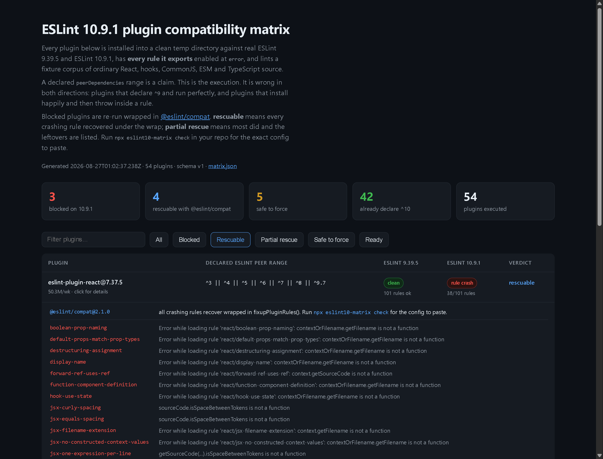

# eslint10-matrix

**Can this repo upgrade to ESLint 10 yet?** Answered by running the plugins, not by reading their manifests.

Three facts, all verifiable at the npm registry right now:

| package | latest version | declared `peerDependencies.eslint` |
| --- | --- | --- |
| `eslint-plugin-react` | 7.37.5 (2025-04-03) | `^3 \|\| ^4 \|\| ^5 \|\| ^6 \|\| ^7 \|\| ^8 \|\| ^9.7` |
| `eslint-plugin-jsx-a11y` | 6.10.2 (2024-10-26) | `^3 \|\| ^4 \|\| ^5 \|\| ^6 \|\| ^7 \|\| ^8 \|\| ^9` |
| `eslint-plugin-import` | 2.32.0 | `^2 \|\| ^3 \|\| ^4 \|\| ^5 \|\| ^6 \|\| ^7.2.0 \|\| ^8 \|\| ^9` |

ESLint's own latest is **10.9.1**. Every one of those ranges excludes it, so `npm install` refuses to resolve them against ESLint 10 and every readiness dashboard built on manifest data marks all three as blocked.

That answer is wrong in both directions. Executed against real ESLint 10.9.1 with every rule enabled:

- `eslint-plugin-import@2.32.0` declares `^9` and **mostly runs**. Three of its 46 rules crash (`no-default-export`, `no-named-export`, `unambiguous`); the other 43 are fine.
- `eslint-plugin-jsx-a11y@6.10.2` declares `^9` and is **completely clean**, all 39 rules, no crashes. Nothing is wrong with it. The range is just stale.
- `eslint-plugin-react@7.37.5` declares `^9` and **38 of its 101 rules throw**, including `display-name` with `contextOrFilename.getFilename is not a function`, exactly [issue #3977](https://github.com/jsx-eslint/eslint-plugin-react/issues/3977), open since February 2026 with hundreds of reactions.

And the failure does not have to be yours. `eslint-plugin-vitest@0.5.4` and `eslint-plugin-deprecation@3.0.0` both **fail to import entirely** on ESLint 10, because `@typescript-eslint/utils` does `class extends eslint.LegacyESLint` and ESLint 10 removed `LegacyESLint` along with eslintrc. Neither plugin's own manifest hints at that.

A declared range is a claim its author last checked at publish time. The only ground truth is execution.

**Live matrix: <https://booyaka101.github.io/eslint10-matrix/>**

## Install

```
npx eslint10-matrix check
```

No install needed. Node 22 or newer, no runtime dependencies.

## Usage

Run it in a repo that has an `eslint.config.js`:

```
$ npx eslint10-matrix check

ESLint 10.9.1 readiness for D:\tmp\scratch-app (7 plugins)
matrix generated 2026-08-27T01:02:37.238Z

BLOCKED (1)
  eslint-plugin-import@2.32.0  3 rules crash on 10.9.1: no-default-export, no-named-export, unambiguous
                               @eslint/compat not attempted: not a removed context API

RESCUABLE (1)  crashes as published, verified clean when wrapped with @eslint/compat
  npm install --save-dev @eslint/compat, then in eslint.config.js:

  eslint-plugin-react@7.37.5  38 rules crash on 10.9.1, all recover wrapped in fixupPluginRules()

    import { fixupPluginRules } from '@eslint/compat';
    import react from 'eslint-plugin-react';

    export default [
      // ...the rest of your config
      {
        plugins: { react: fixupPluginRules(react) },
      },
    ];

SAFE TO FORCE (1)  declared below ^10, verified clean on 10.9.1 with all rules enabled
  eslint-plugin-jsx-a11y@6.10.2

  Add to package.json to install them against ESLint 10 anyway:
    {
      "overrides": {
        "eslint-plugin-jsx-a11y": {
          "eslint": "$eslint"
        }
      }
    }

CLEAN (4)  already declares ^10
  @typescript-eslint/eslint-plugin@8.68.0, eslint-plugin-n@18.3.0, eslint-plugin-promise@7.3.0, eslint-plugin-unicorn@73.0.0

First crash observed:
  eslint-plugin-import/no-default-export: Error while loading rule 'import/no-default-export': Cannot use 'in' operator to search for 'sourceType' in undefined

2 of 7 plugins block the upgrade to ESLint 10.9.1 (1 of them rescuable with @eslint/compat).
```

That is real output from the run recorded in this repo's `matrix.json`, against a repo whose `eslint.config.js` uses those seven plugins.

The buckets are the whole point:

- **BLOCKED**. Actually breaks, and wrapping does not help. Wait for a release, switch plugin, or disable the crashing rules.
- **RESCUABLE**. Breaks as published, but every crashing rule recovers when the plugin is wrapped with [@eslint/compat](https://www.npmjs.com/package/@eslint/compat). The report prints the exact `eslint.config.js` wiring to paste.
- **PARTIAL-RESCUE**. The wrap fixes most crashing rules; the report names the ones you still have to disable.
- **SAFE TO FORCE**. Declares an old range but runs clean with every rule enabled. The `overrides` block installs it against ESLint 10 anyway. `$eslint` resolves to whatever your root `eslint` dependency is, so you do not have to repeat the version.
- **CLEAN**. Already declares `^10`. Nothing to do.

## Rescue verdicts, measured not assumed

ESLint 9 reached end of life on 2026-08-06, so waiting on 9 is no longer a plan. For plugins the
matrix marks BLOCKED, the nightly run now re-lints the same fixture corpus with the plugin wrapped
in @eslint/compat 2.1.0's `fixupPluginRules()` (or `fixupConfigRules()` when the plugin exports
flat configs, whichever works is recorded). The verdict comes from the before and after crash
counts of that run, never from the wrapper's own claim that it "fixes the most common issues",
which is exactly why PARTIAL-RESCUE exists.

The worked example is `eslint-plugin-react@7.37.5`, the same plugin behind
[issue #3977](https://github.com/jsx-eslint/eslint-plugin-react/issues/3977): 38 of its 101 rules
crash on ESLint 10.9.1 with `contextOrFilename.getFilename is not a function`. Wrapped in
`fixupPluginRules()` **all 38 recover**, so the matrix records it as RESCUABLE.

Reproduced end to end in a scratch repo with the real plugin, not a fixture:

```
$ npx eslint .                       # eslint-plugin-react@7.37.5 as published
Oops! Something went wrong! :(
ESLint: 10.9.1
TypeError: Error while loading rule 'react/display-name': contextOrFilename.getFilename is not a function
    at resolveBasedir (node_modules/eslint-plugin-react/lib/util/version.js:31:100)

$ npx eslint .                       # after pasting the snippet check printed
$ echo $?
0
```

Across the current 54-plugin corpus, 4 plugins are RESCUABLE: `eslint-plugin-react` (38 rules),
`eslint-plugin-node` (the 8 that ESLint 10 broke), `eslint-plugin-eslint-comments` (8) and
`eslint-plugin-lodash` (1). That moves the blocked count from 7 to 3.

Not every crash is rescuable, and the matrix never guesses. A crash whose cause is not a removed
context API (an install failure, a missing dependency, a Node engine mismatch, a parser failure)
is classified and skipped with the reason recorded. `eslint-plugin-import` is the live example:
its three crashing rules die on `Cannot use 'in' operator to search for 'sourceType' in undefined`,
which no rule wrapper repairs, so it stays BLOCKED with that classification instead of getting a
snippet that would not work. `eslint-plugin-vitest` and `eslint-plugin-deprecation` are the other
side: the rescue pass does try them, because their failure names a removed API, and reports that
wrapping rules cannot fix a crash that happens at import time.

A plugin that also crashes on ESLint 9 keeps that breakage after the wrap, and the report says so
rather than claiming a clean run. `eslint-plugin-node` is the case: 12 of its rules crash on both
versions, 8 more only on 10, and only those 8 are what RESCUABLE speaks to.



### Commands

```
eslint10-matrix check [dir]      report ESLint 10 readiness for a repo (default: .)
eslint10-matrix plugins          list every plugin in the published matrix
```

### Options

| flag | effect |
| --- | --- |
| `--ci` | exit 1 when any plugin is BLOCKED, RESCUABLE or PARTIAL-RESCUE. Without it the command always exits 0. |
| `--json` | machine-readable output, including the `overrides` object |
| `--matrix <src>` | use a local `matrix.json` path or a different URL |
| `--no-cache` | never read or write `~/.cache/eslint10-matrix` |
| `--plugins <a,b>` | skip config resolution and check these package names directly |
| `--timeout <ms>` | network timeout for fetching the matrix (default 15000) |
| `--no-color` | disable ANSI colour |

### In CI

```yaml
- run: npx eslint10-matrix check --ci
```

Fails the job while anything is blocked, passes the moment the last blocker ships a fix. That turns "is our ESLint 10 upgrade unblocked yet" into a check that answers itself instead of a ticket somebody re-reads every sprint.

Exit codes: `0` report printed, `1` `--ci` and something is BLOCKED, `2` the command could not run (no flat config, no matrix, bad arguments).

## How the matrix is produced

Nightly, for each plugin and each of ESLint 9.39.5 and 10.9.1:

1. `mkdtemp` a fresh directory and write a minimal `package.json`.
2. `npm install --legacy-peer-deps` the plugin at `latest`, ESLint at the pinned version, and any real peer packages it needs (`typescript`, `vue-eslint-parser`, `react`). The `--legacy-peer-deps` is the experiment: the declared range is what we are testing, so we install past it deliberately.
3. Import the plugin, collect every rule from `configs.all.rules` (or `Object.keys(plugin.rules)`), and enable all of them at `error`.
4. Lint a checked-in corpus of ordinary React, hooks, CommonJS, ESM, JSX-a11y and TypeScript source.
5. Classify: **clean**, **rule-crash**, **load-fail**, or **install-fail**.
6. For a plugin that regressed on 10 through a removed context API, install `@eslint/compat@2.1.0`
   into a fresh isolated directory (its peer range covers 10, no extra forcing needed) and repeat
   the identical run with the plugin wrapped. Crashes at zero is RESCUABLE, fewer is
   PARTIAL-RESCUE with the residual rules stored, no change stays BLOCKED. A failure that
   reproduces identically on ESLint 9, and a plugin that is SAFE TO FORCE or CLEAN, never enters
   the rescue pass, so a no-op wrap can never be reported as a rescue.

A crashing rule aborts the entire lint run at the first casualty, so when the all-rules pass fails the runner re-lints **one rule at a time** to enumerate every broken rule rather than just the first. That is why the react row names 38 rules and not 1.

Both ESLint versions are executed so the report can answer the question you actually asked: **what does the upgrade break?** A failure that reproduces identically on ESLint 9 is not an ESLint 10 blocker, so it is reported as pre-existing and the plugin is not marked BLOCKED. `@typescript-eslint/eslint-plugin` is the case that proves it: 64 of its rules refuse to load without `parserOptions.project`, identically on 9 and 10. Counting those would have marked the most-installed plugin in the ecosystem as blocked over a `tsconfig` setting.

Volume of lint errors never affects the verdict. Enabling every rule on real source produces thousands of ordinary reports; only a module that fails to import and a rule that throws or emits a fatal message count against a plugin. ESLint validates rule options before running, so a rule that needs required options is recorded separately as a config problem, not as a compatibility failure.

Everything runs in a child process, so a plugin that hard-crashes the Node process takes down only its own probe.

### Configuration in `plugins.json`

Each entry may carry `settings`, `parser` and `extraDeps`, the same configuration an ordinary repo supplies. This is not cosmetic. `eslint-plugin-react` only reaches the removed `context.getFilename()` API when it is asked to detect the React version, so without `settings: { react: { version: 'detect' } }` only 6 of its 38 broken rules surface. Testing plugins in a configuration nobody actually uses would understate the breakage.

## Limitations

- **Two ESLint versions**, the current `latest` (10.9.1) and the current `maintenance` (9.39.5). No sweep across the earlier 10.x minors.
- **Latest plugin version only.** If you are pinned to an older release, the row tells you where that plugin stands at its newest published version, not at yours.
- **Flat config only.** ESLint 10 removed eslintrc, so a repo still on `.eslintrc` has a bigger migration than this tool measures.
- **Fixture corpus, not your code.** A rule that only crashes on a syntax the corpus never uses will read as clean. Contributions to `packages/runner/fixtures/` are the fix.
- **`plugins` maps only.** Plugins pulled in through a shared config's `extends` are not attributed to a package name; use `--plugins` to check those explicitly.
- **Rules that exist only inside a plugin's exported flat config**, with no top-level `rules` map, are recorded as a config prerequisite rather than linted, so such a plugin reads as clean and never reaches the rescue pass.
- **A config that default-exports a function** is resolved by the ESLint CLI, not by this tool. Export the array, or pass `--plugins`.
- The matrix is cached at `~/.cache/eslint10-matrix` and used when the network is unavailable, with a warning naming the age of the copy.

## Development

```
npm ci
npm run build                                    # both packages
npm run lint                                     # this repo lints itself, on ESLint 10
npm test                                         # 63 tests, vitest (build first: the end-to-end test drives the built CLI)
node packages/runner/dist/run.js --only eslint-plugin-react   # one plugin
node packages/runner/dist/run.js                 # full pass, ~7 minutes
node site/build.mjs --in matrix.json --out site/dist
```

The runner takes `--shard i/n` so the nightly workflow can fan out across four jobs and merge with `scripts/merge-shards.mjs`.

### Adding a plugin

Add an entry to `packages/runner/src/plugins.json` with `name` and `weeklyDownloads`, plus `parser`/`extraDeps`/`settings` if it needs them, then open a PR. Or open an issue and it will be added on the next pass.

## Matrix schema

```jsonc
{
  "schemaVersion": 1,
  "generatedAt": "2026-08-22T09:12:44.108Z",
  "eslintVersions": { "v9": "9.39.5", "v10": "10.9.1" },
  "plugins": [
    {
      "name": "eslint-plugin-react",
      "version": "7.37.5",
      "declaredPeerRange": "^3 || ^4 || ^5 || ^6 || ^7 || ^8 || ^9.7",
      "weeklyDownloads": 50254779,
      "results": {
        "10.9.1": {
          "status": "rule-crash",              // clean | rule-crash | load-fail | install-fail
          "crashingRules": [{ "rule": "display-name", "message": "..." }],
          "totalRules": 101
        }
      },
      "rescue": {                              // only on plugins that regressed on 10
        "eslintVersion": "10.9.1",
        "compatVersion": "2.1.0",
        "attempted": true,                     // false with a skipReason when the cause is not a removed API
        "verdict": "rescuable",                // rescuable | partial-rescue | blocked
        "fixupFunction": "fixupPluginRules",   // or fixupConfigRules, with fixupConfigKey
        "crashingRulesBefore": 38,
        "crashingRulesAfter": 0,
        "residualRules": []                    // populated for partial-rescue
      }
    }
  ]
}
```

The `rescue` field is additive: nothing existing was renamed or removed and the schema version is
still 1, so tools reading the old shape keep working.

## Telling people about it

The one place worth posting is the thread people are already stuck in, not a new announcement.
[jsx-eslint/eslint-plugin-react#3977](https://github.com/jsx-eslint/eslint-plugin-react/issues/3977)
has hundreds of reactions from people who cannot upgrade, and what helps there is the executed data:
which rules break, why, and which of your other plugins are already fine. Lead with that, link the
matrix once at the end, and skip it entirely if you have nothing new to add to the thread.

## License

MIT
